# 乐思赋能平台
[](https://gitee.com/libihao520/ai-recognition-system/stargazers)
[](https://gitee.com/libihao520/ai-recognition-system/members)
## 演示地址
http://47.107.226.106:8080/login
 - 账号：lbhlbh
 - 密码：123456
## 功能模块

1.  登录注册
2.  数据大屏
3.  练题系统
4.  AI模块
5.  工具箱
6.  个人中心

## 框架开发依赖环境
 - 基于微软.NetCore8.0、C#12.0 开发，采用了主流数据库 MySQL、Redis，ORM 框架为 EFCore
 - 后端：asp.net Core Api、JWT、QRCode、YoloDotNet、Autofac、AutoMapper、EPPlus、wrod模板引擎SharpDocx、YOLOv8、ONNX 
 - 前端：vue3、nodejs、vuex、axios请求、promise、element ui、element plus、pinia用户仓库与token持久化

## 安装教程

1.  模型合并
```
因为我的演示模型过大，我单独上传到了百度云网盘了，如果需要的话请自行下载
通过网盘分享的文件：Model
链接: https://pan.baidu.com/s/1sTZ8uQLpyrl3hygkZ3VmvA?pwd=ewfk 提取码: ewfk
模型下载下来后放到路径 ai-recognition-system\Ai-Web-API\WebApi\Model 下
```


## 详细介绍
提示：因本开源项目还在开发阶段，下面介绍可能和实际项目有所差异
### 登录注册

```
首次登入可通过邮箱获取验证码注册账号，验证码会在后台储存在Redis，有效期为30分钟。
```
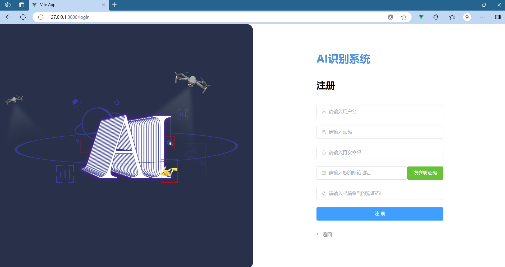
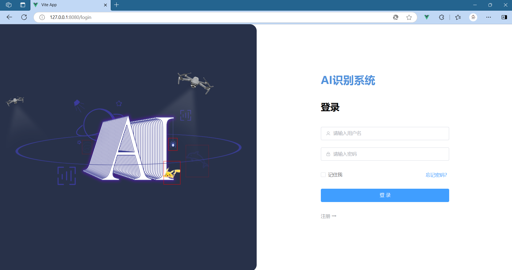

### 数据大屏
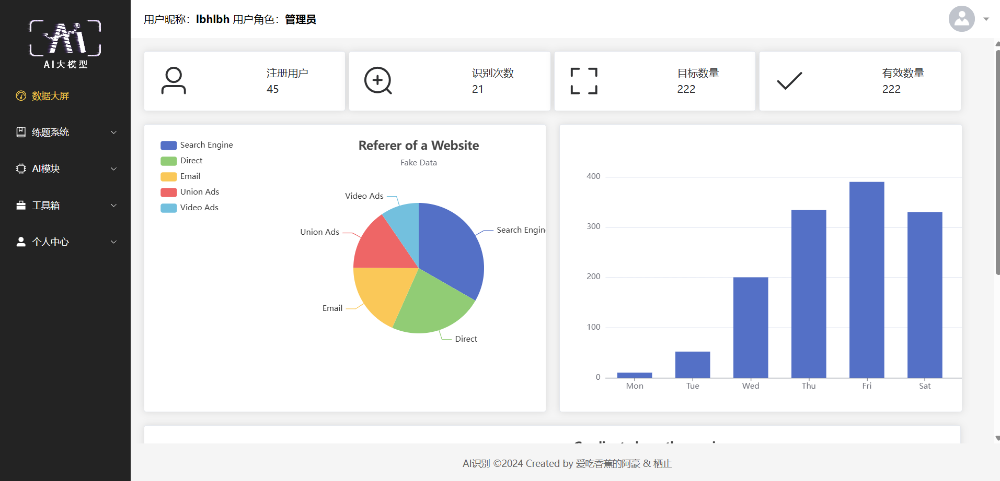

### 练题系统
```
题库管理：支持用户下载模板，按模板导入单选题、多选题、判断题。
```

```
在线答题：展示导入试题，用户可选题组卷答题并提交。
```
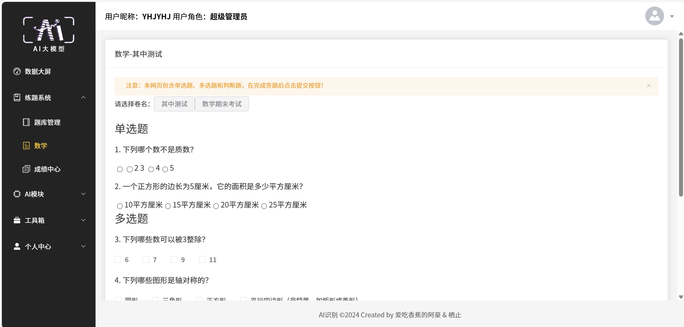
```
成绩中心：管理各用户的答题情况，点击操作列的删除按钮，可以删除该次答题记录。
点击下载按钮，会自动下载该次答题的详细记录。如下图
```
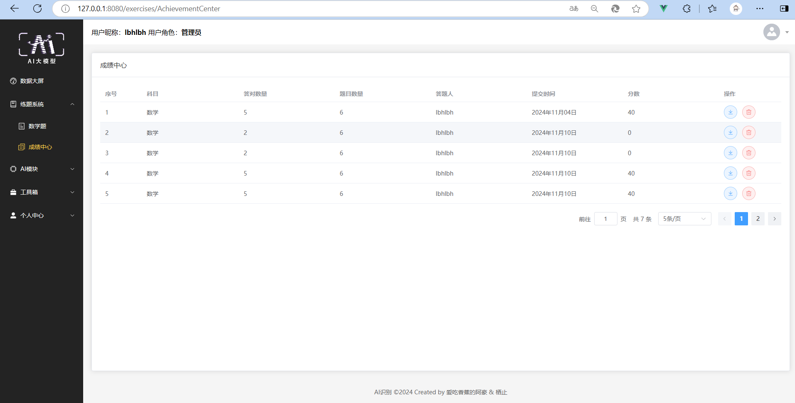
```
在下载的答题记录中，展示姓名、分数、正确答案、作答人所选答案等信息！
```
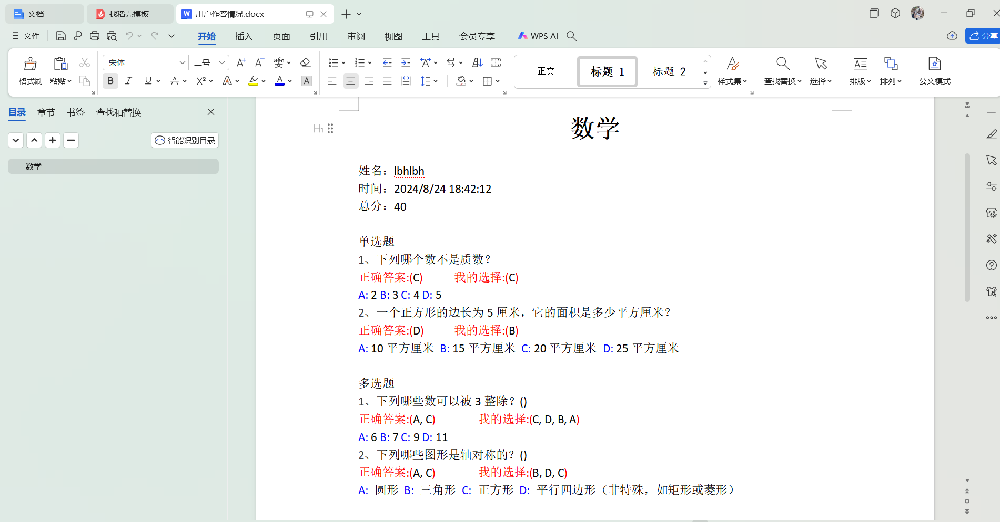

### AI模块
```
模型管理：可检查和上传模型。
```

```
在线识别：选择模型，上传图片（或者点击示例，将上传示例图片）！
点击开始识别，将会对上传的图片进行AI识别。如下图
```
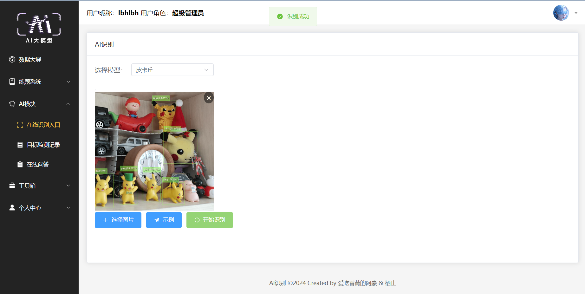

```
识别记录：对在线识别结果进行审核,以及人工手动添加识别记录。
```


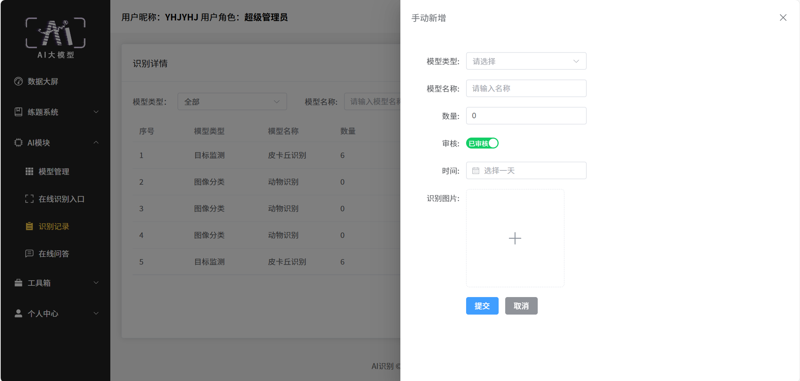

```
AI大模型：深度集成讯飞星火 spark max 强大的自然语言处理能力
```
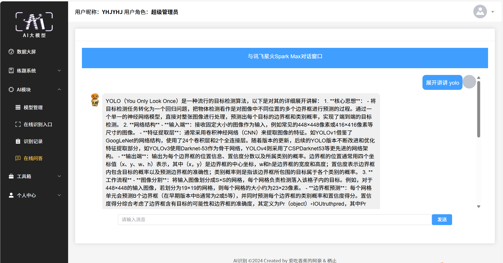

### 工具箱
```
工具箱的二维码生成功能，可根据字符串生成二维码，如下图！
```
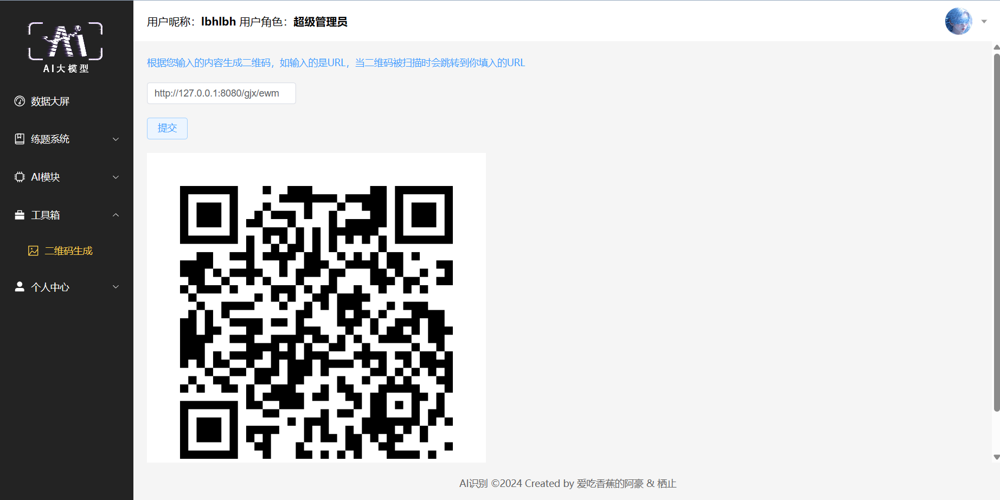
### 个人中心
```
在个人中心模块，超级管理员可以批量管理系统所有用户，如使用模板批量导入导出用户！
普通用户可编辑自己的个人资料以及更换头像等操作。如下图！
```
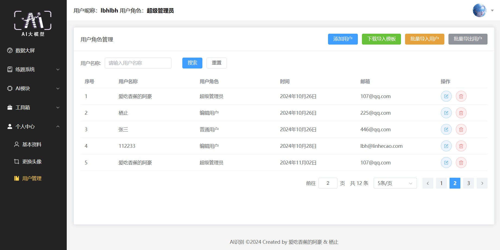
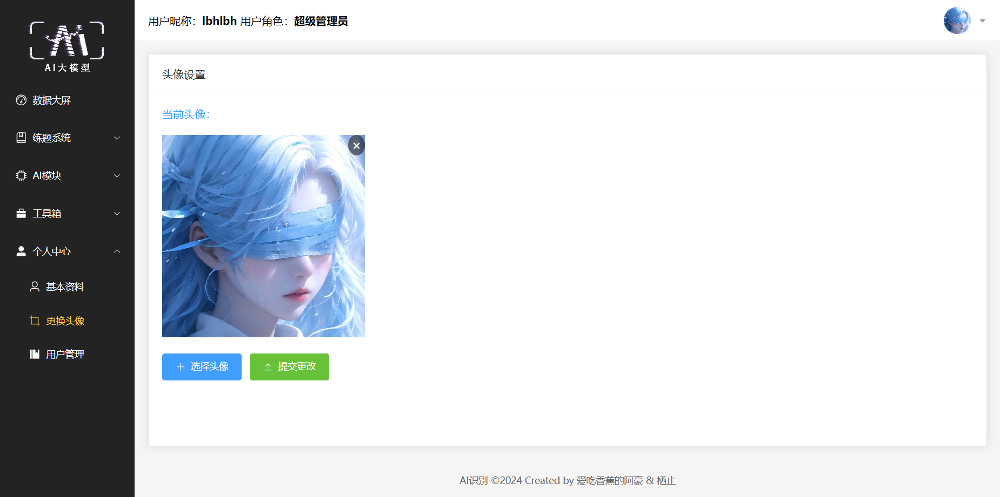
##  系统流程图
本项目旨在构建一个多功能的用户交互系统，集成了数据查看、练习模块、个人中心管理和用户资料修改等功能。通过用户登录系统，用户可以选择进入不同的模块进行操作。
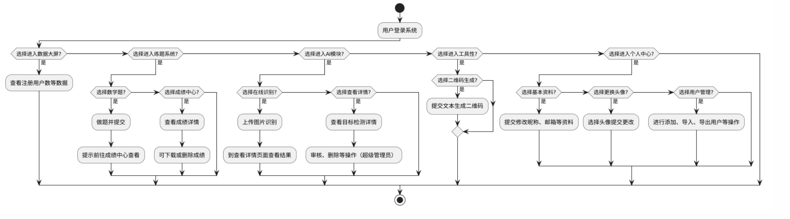

##  E-R图

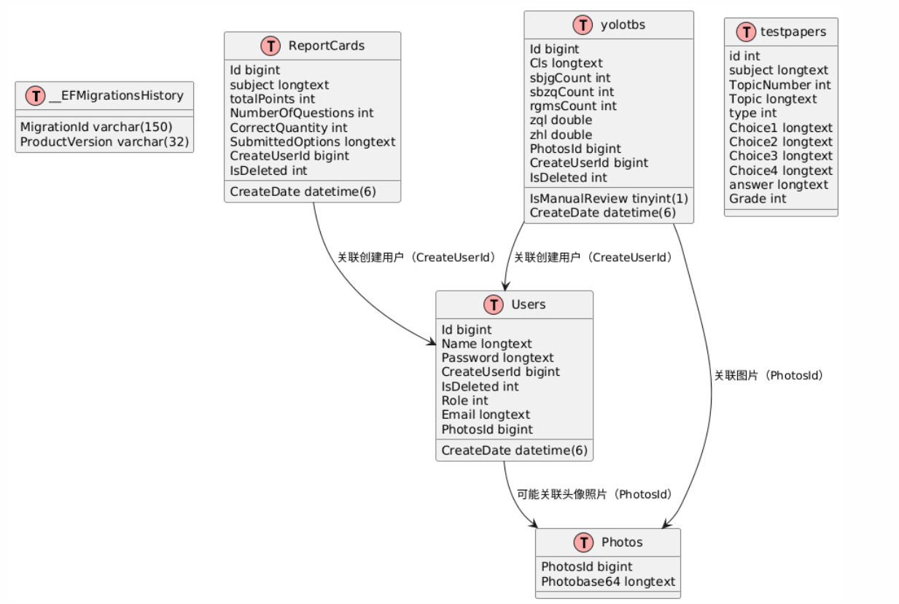


## 开发人员

1.  爱吃香蕉的阿豪
2.  栖止


