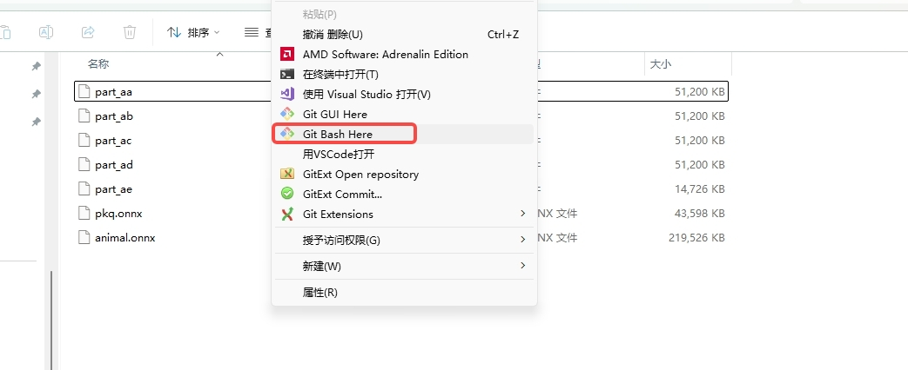
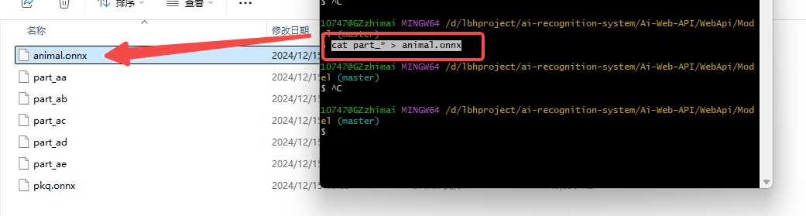

# 乐思赋能平台

## 功能模块

1.  登录注册
2.  数据大屏
3.  练题系统
4.  AI模块
5.  工具箱
6.  个人中心

## 框架开发依赖环境
 - 基于微软.NetCore8.0、C#12.0 开发，采用了主流数据库 MySQL、Redis，ORM 框架为 EFCore
 - 后端：asp.net Core Api、JWT、QRCode、YoloDotNet、Autofac、AutoMapper、EPPlus、wrod模板引擎SharpDocx、YOLOv8、ONNX 
 - 前端：vue3、nodejs、vuex、axios请求、promise、element ui、element plus、pinia用户仓库与token持久化

## 安装教程

1.  模型合并
```
因为模型过大，被分割上传到git中，因此将代码拉取下来后需要本地对模型进行合成
在路径 ai-recognition-system\Ai-Web-API\WebApi\Model 下，可见有很多part_开头的文件
右键，点击Git Bash Here
执行命令  cat part_* > animal.onnx 在文件夹下就会有我们合成后的模型animal.onnx
```


1.  xxxx
2.  xxxx

## 详细介绍
提示：因本开源项目还在开发阶段，下面介绍可能和实际项目有所差异
### 登录注册

```
首次登入可通过邮箱获取验证码注册账号，验证码会在后台储存在Redis，有效期为30分钟。
```


### 数据大屏


### 练题系统
```
练题系统包含单选题、多选题和判断题，
在完成答题后点击提交按钮，后台会自动计算分数，并将答题情况保存到成绩中心。
```

```
在成绩中心，可以管理各用户的答题情况，点击操作列的删除按钮，可以删除该次答题记录。
点击下载按钮，会自动下载该次答题的详细记录。如下图
```

```
在下载的答题记录中，展示姓名、分数、正确答案、作答人所选答案等信息！
```

### AI模块
### 工具箱
### 个人中心
## 开发人员

1.  爱吃香蕉的阿豪
2.  栖止


